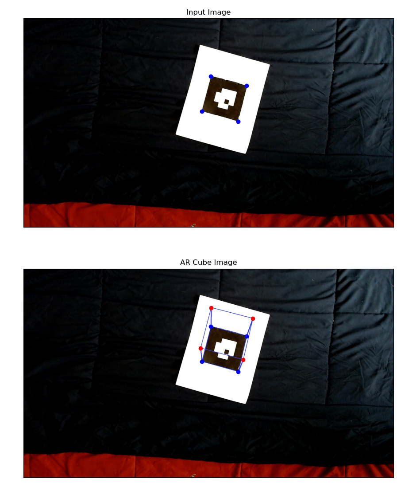
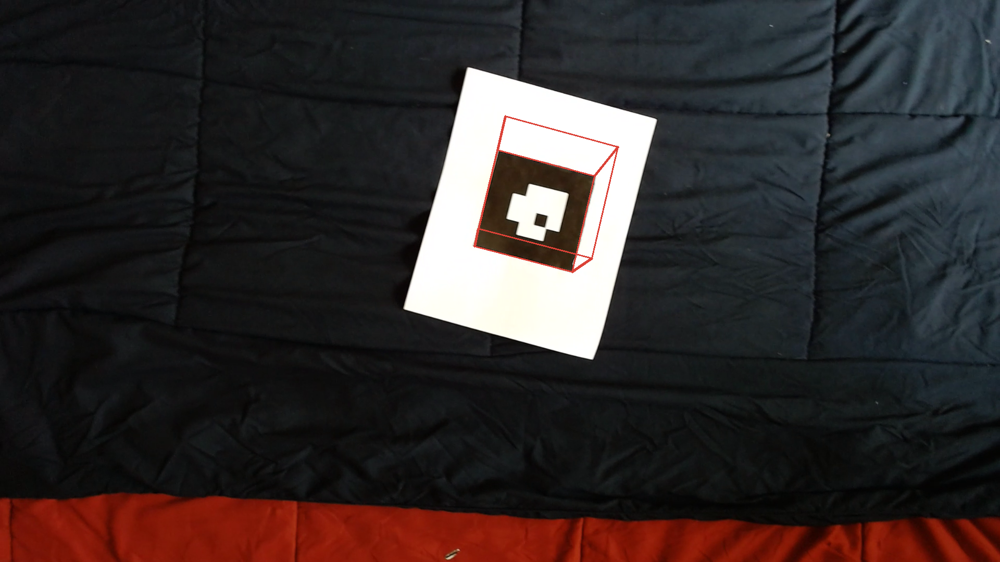

# Augmented-Reality-3DObject-Projection-On-Video
Objective : Project a 3D Object on top of a April tag by computing Projection matrix
## Results:

1. Tag detection:

2. Tag detection performed on a video:

